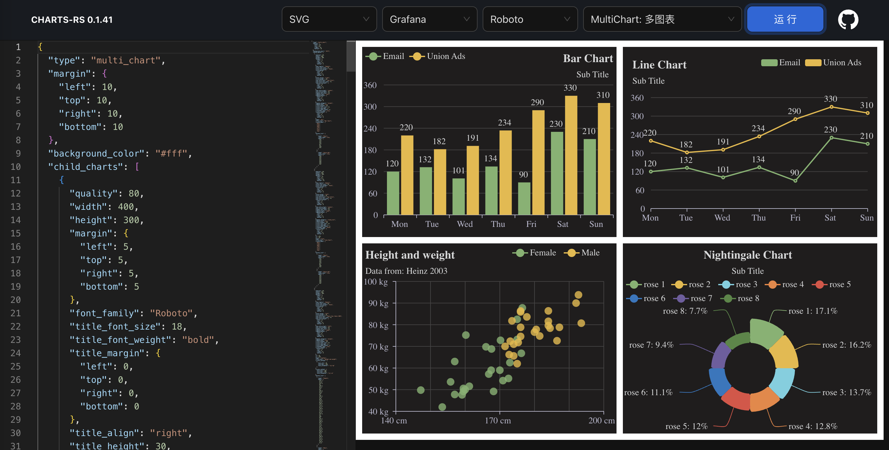

# charts-rs-web

以json的形式定义图表的相关参数，简单易用，可选择svg或png的形式返回。

<p align="center">
  
</p>

## HTTP接口

- `GET /api/basic-info`: 返回应用信息：版本与字体等。默认支持两种字体`Noto Sans SC`与`Roboto`
- `POST /api/charts/png`: 生成Png图表
- `POST /api/charts/jpeg`: 生成Jpeg图表
- `POST /api/charts/webp`: 生成Webp图表
- `POST /api/charts/avif`: 生成Avif图表（注意生成avif需要时间较长）
- `POST /api/charts/svg`: 生成Svg图表

## JSON参数

生成PNG与SVG的json参数基本一致，下面针对各参数一下讲解：

### 公共参数

- `type`: 图表类型，默认为`bar`，可选的值为：`line`，`horizontal_bar`，`pie`，`radar`，`table`，以及`bar`
- `quality`: 输出的PNG图片质量，默认为`80`，若指定为`0`则表示不压缩。图片质量为`80`时，图片大小`7kb`，总体耗时`52ms`。不压缩时，图片大小`46kb`，总体耗时`26ms`
- `theme`: 图表主题，支持`light`, `dark`, `ant`以及`grafana`等多9种主题色
- `width`: 图表宽度，默认为600
- `height`: 图表调试，默认为400
- `background_color`: 图表底色，不同的主题有不同的默认颜色
- `margin`: 图表的margin，默认为`{"left":5,"top":5,"right":5,"bottom":5}`
- `font_family`: 图表使用的字体，默认为`Roboto`
- `title_text`: 图表标题
- `title_font_size`: 标题的字体大小，默认为`18`
- `title_font_color`: 标题的字体颜色，不同的主题有不同的默认颜色
- `title_font_weight`: 标题的字体粗细，默认为`bold`
- `title_margin`: 标题的margin，默认为`0`
- `title_align`: 标题的位置，默认为`center`，可选值为：`left`, `center`以及`right`
- `title_height`: 标题高度，默认为`30`
- `sub_title_text`: 子标题
- `sub_title_font_size`: 子标题的字体大小，默认为`14`
- `sub_title_font_color`: 子标题的字体颜色，不同的主题有不同的默认颜色
- `sub_title_font_weight`: 标题的字体粗细，默认为空
- `sub_title_margin`: 子标题的margin，默认为`0`
- `sub_title_align`: 子标题的位置，默认为`center`，可选值为：`left`, `center`以及`right`
- `sub_title_height`: 子标题高度，默认为`20`
- `legend_font_size`: 图示的字体大小，默认为`14`
- `legend_font_color`: 图示的字体颜色，不同的主题有不同的默认颜色
- `legend_font_weight`: 图标的字体粗细，默认为空
- `legend_align`: 图示的位置，默认为`center`，可选值为：`left`, `center`以及`right`
- `legend_margin`: 图示的margin，默认为`0`
- `legend_category`: 图示的类型，默认为`normal`，可选值为：`normal`以及`rect`
- `legend_show`: 图示是否显示，默认为`true`

### 网格属性

使用网格的图表中使用，如：`line`，`bar`等

- `grid_stroke_color`: 图表网格线条颜色，不同的主题有不同的默认颜色
- `grid_stroke_width`: 图表网格线条宽度，默认为`1`


### 图表线条相关属性

- `series_stroke_width`: 图表线条宽度，默认为`2`
- `series_label_font_color`: 图表中的label字体颜色，不同的主题有不同的默认颜色
- `series_label_font_size`: 图表中的label字体大小，默认为`14`
- `series_label_font_weight`: 图表中label字体粗细，默认为空
- `series_colors`: 图表使用的颜色列表，不同的主题有不同的颜色列表，用于不同各类的示例中使用
- `series_smooth`: 图表线条是否使用平滑曲线，默认为`false`
- `series_fill`: 图表线条曲线是否填充对应区域，默认为`false`


### X轴相关属性

- `x_axis_data`: X轴的数据
- `x_axis_height`: X轴的高度，默认为`30`
- `x_axis_stroke_color`: X轴线条的颜色，不同的主题有不同的默认颜色
- `x_axis_font_size`: X轴的字体大小，默认为`14`
- `x_axis_font_color`: X轴的字体颜色，不同的主题有不同的默认颜色
- `x_axis_font_weight`: X轴的字体粗细，默认为空
- `x_axis_name_gap`: X轴文本名称与轴的间隔，默认为`5`
- `x_axis_name_rotate`: X轴文本名称的旋转角度，默认为`0`
- `x_axis_margin`: X轴的margin，默认为None
- `x_boundary_gap`: X轴的坐标留边处理，无默认值，可设置为`true`或者`false`


### Y轴相关属性

- `y_axis_configs`: Y轴属性配置，类型为数组
- `y_axis_configs.axis_font_size`: Y轴字体大小，默认为`14`
- `y_axis_configs.axis_font_color`: Y轴字体颜色，不同的主题有不同的默认颜色
- `y_axis_configs.axis_stroke_color`: Y轴线条颜色，不同的主题有不同的默认颜色
- `y_axis_configs.axis_width`: Y轴宽度，未设置则通过计算得出
- `y_axis_configs.axis_split_number`: Y轴坐标分块数量，默认为`6`
- `y_axis_configs.axis_name_gap`: Y轴名称文本与轴的间隔，默认为`8`
- `y_axis_configs.axis_margin`: Y轴的margin，默认为None
- `y_axis_configs.axis_formatter`: Y轴名称格式化方式，可以使用以下方式`{c} ml`
- `y_axis_configs.axis_min`: Y轴的最少值，默认为None
- `y_axis_configs.axis_max`: Y轴的最大值，默认为None

### 图表数据列表

- `series_list`: 图表数据系列，类型为数组
- `series_list.name`: 数据名称，不能为空
- `series_list.index`: 指定数据的index，此index影响其颜色等，一般场景不需要指定
- `series_list.y_axis_index`: 数据对应的Y轴，如果该数据非使用第一个Y轴时可指定（同时Y轴需要初始化为多个）
- `series_list.label_show`: 数据的label是否展示，默认为`false`
- `series_list.category`: 数据的类型，用于在`bar`图表中指定某些数据以`line`的形式混合展示，可选值为`bar`与`line`

### 饼图相关属性

饼图有部分属性是其单独例如的，具体如下：

- `radius`: 半径，默认值为`150`
- `inner_radius`: 内半径，默认值为`40`
- `border_radius`: 圆角半径，默认为`8`
- `rose_type`: 是否玫瑰图形式，默认为`true`

### 蜡烛图相关属性

需要注意，K线图的数据合并在一维数组中，顺序为：开市值(open)，收市值(close)，最低值(lowest)，最高值(highest)

- `candlestick_up_color`: 上涨图颜色
- `candlestick_up_border_color`: 上涨图边框颜色
- `candlestick_down_color`: 下跌图颜色
- `candlestick_down_border_color`: 下跌图边框颜色

## 表格相关属性

表格的相关属性与其它图的不尽相同，与公共属性相同部分为：`type`，`quality`，`theme`，`width`，`height`，`font_family`，`background_color`，还有`title`与`sub_title`部分也一致。

不相同的如下：

- `data`: 表格数据，其为二维数组，而且不能为空。第一个数组对应表头数据
- `spans`: 表格每列所占比例，例如[0.5, 0.2, 0.3]，默认为根据列的数量均分
- `text_aligns`: 表格列的文本对齐方式，默认为`left`，可以按需设置，如["left", "center", "right"]
- `border_color`: 表格边框颜色，不同的主题有不同的默认颜色
- `header_row_padding`: 表头的padding，默认为`{"left": 10, "top": 8, "right": 10, "bottom": 8}`
- `header_row_height`: 表头行高，默认为`30`
- `header_font_size`: 表头字体，默认`14`
- `header_font_color`: 表头字体颜色，不同的主题有不同的默认颜色
- `header_background_color`: 表头背景颜色，不同的主题有不同的默认颜色
- `body_row_padding`: 表头的padding，默认为`{"left": 10, "top": 5, "right": 10, "bottom": 5}`
- `body_row_height`: 表格内容行高，默认为`30`
- `body_font_size`: 表头字体，默认`14`
- `body_font_color`: 表头字体颜色，不同的主题有不同的默认颜色
- `body_background_colors`: 表头背景颜色，不同的主题有不同的默认颜色
- `cell_styles`: 定义表格中每一个格的相关属性，其为数组
- `cell_styles.font_color`: 表格中该格的字体颜色(可选)，若未指定则使用表格指定的字体颜色
- `cell_styles.font_weight`: 表格中该格的字体粗细(可选)
- `cell_styles.background_color`: 表格中该格的背景色(可选)，若未指定则使用表格指定的背景色
- `cell_styles.indexes`: 该表格中格的位置，数组为两位，第一位为行，第二位为列，表头为第一行，该参数不能为空


## 多图的相关属性

- `margin`: 图表的margin，默认为`{"left":10,"top":10,"right":10,"bottom":10}`
- `background_color`: 背景色，默认无
- `child_charts`: 子图表列表

## 启动

需要注意，此镜像加载了`NotoSansSC`字体(6种粗细大小)，如果需要加载更多的字体，可运行时挂载字体目录，并通过ENV指定CHARTS_FONT_PATH为对应路径（其默认值为：/usr/share/fonts），如果有多个目录以,分隔，如`CHARTS_FONT_PATH=/usr/share/fonts,/fonts`，支持`ttf`与`otf`字体，首次启动时加载一个字体会使用100ms左右，字体越多则越慢。

需要注意，因为性能考虑字库是加载到内存中，因此加载的字库越多，内存占用越大。

```bash
docker run -d --restart=always \
  -p 5000:5000 \
  --name charts-rs-web \
  vicanso/charts-rs-web
```
